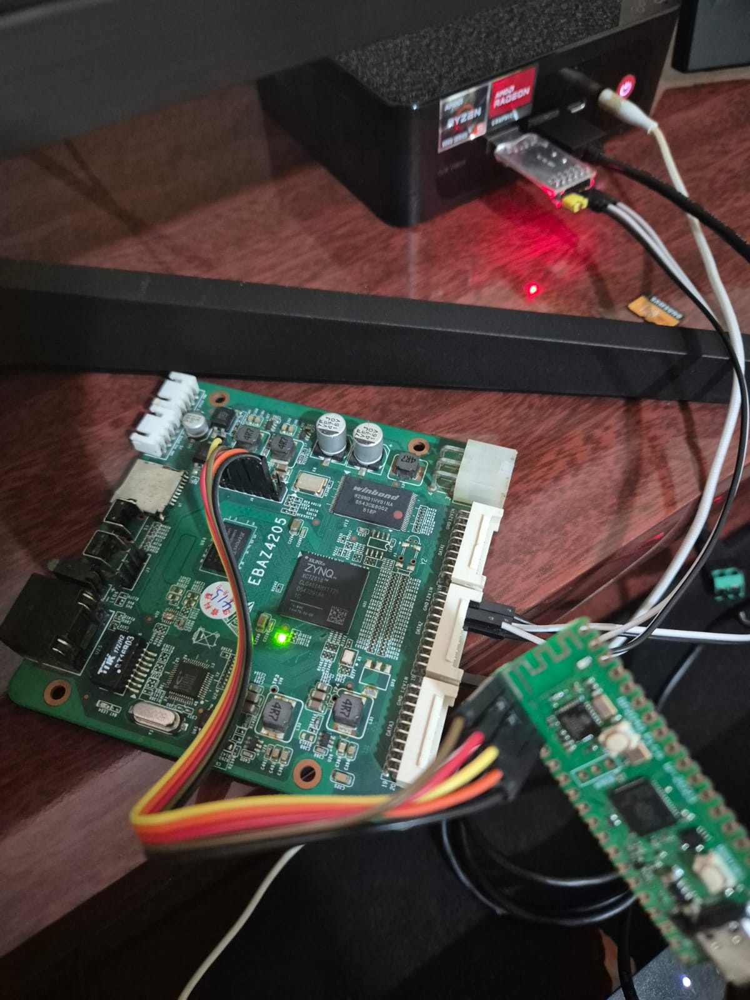

# 🏗️ EBAZ 4205 DuinoCoin FPGA Miner

[](LICENSE)
[](https://en.wikipedia.org/wiki/Verilog)
[](https://www.python.org/)
[](https://github.com)
[](#performance)


### Did you like the project? Leave a star ⭐ or buy me a coffee 💰. 
#### DuinoCoin Wallet: frenow 
#### BTC Wallet: bc1qdf5qhmfymltn8xu52grlnskdelz8unsznljwe5

Um minerador de **DuinoCoin** de alto desempenho implementado em FPGA usando a placa **EBAZ 4205** com Zynq-7010. Implementa **8 cores SHA-1 em paralelo** para máxima eficiência criptográfica. **Ativo e minerando** com hashrate real de **4.688 kH/s** em dificuldade **900.872**.



---

## 📋 Índice

- [Características](#características)
- [Hardware](#hardware)
- [Arquitetura](#arquitetura)
- [Instalação](#instalação)
- [Configuração](#configuração)
- [Uso](#uso)
- [Estrutura de Arquivos](#estrutura-de-arquivos)
- [Performance](#performance)
- [Troubleshooting](#troubleshooting)
- [Contribuindo](#contribuindo)
- [Licença](#licença)

---

## 🔧 Implementação Dinâmica (Generate Blocks)

A implementação utiliza **Verilog `generate` statements** para criar instâncias parametrizadas sem hardcoding:

### 1. Geração de Nonces (top.v:70-76)

```verilog
generate
    genvar i;
    for (i = 0; i < MAX_CORE; i = i + 1) begin : nonce_gen
        assign nonce[i] = nonce_0 + i;
    end
endgenerate
```

**Resultado com MAX_CORE=8:**
- `nonce[0] = nonce_0 + 0`
- `nonce[1] = nonce_0 + 1`
- ... até `nonce[7] = nonce_0 + 7`

### 2. BCD Converters (top.v:117-135)

```verilog
generate
    genvar j;
    for (j = 0; j < MAX_CORE; j = j + 1) begin : bcd_loop
        nonce_bcd_simple bcd_inst (
            .nonce(nonce[j]),
            .digit9(digit9[j]), .digit8(digit8[j]), ...,
            .digit_count(nonce_ascii_len[j])
        );
    end
endgenerate
```

**Cria 8 conversores BCD em paralelo**, cada um gerando dígitos ASCII para um nonce diferente.

### 3. Conversão BCD→ASCII (top.v:152-172)

```verilog
generate
    genvar k;
    for (k = 0; k < MAX_CORE; k = k + 1) begin : ascii_conv_loop
        always @(*) begin
            case (nonce_ascii_len[k])
                4'd1: nonce_ascii[k] = {64'd0, 8'h30 + digit1[k]};
                4'd2: nonce_ascii[k] = {56'd0, 8'h30 + digit2[k], ...};
                // ... até 4'd9
                default: nonce_ascii[k] = 72'd0;
            endcase
        end
    end
endgenerate
```

**Converte cada BCD em ASCII** com padding inteligente (sem zeros à esquerda).

### 4. Message Builders (top.v:222-305)

```verilog
generate
    genvar z;
    for (z = 0; z < MAX_CORE; z = z + 1) begin : msg_block_gen
        always @(*) begin
            case (nonce_ascii_len[z])
                4'd1: nonce_pad_part = {nonce_ascii[z][7:0], 8'h80, ...};
                4'd2: nonce_pad_part = {nonce_ascii[z][15:0], 8'h80, ...};
                // ... até 4'd9
            endcase
            MESSAGE_BLOCK[z] = {msg_part, nonce_pad_part};
        end
    end
endgenerate
```

**Constrói blocos de mensagem de 512 bits** com padding RFC 3174 para cada core.

### 5. SHA-1 Core Instances (top.v:423-438)

```verilog
generate
    genvar p;
    for (p = 0; p < MAX_CORE; p = p + 1) begin : sha1_loop
        sha1_core sha1_inst (
            .clk(clk),
            .reset_n(rst_n),
            .init(sha1_init[p]),
            .next(sha1_next[p]),
            .block(MESSAGE_BLOCK[p]),
            .ready(sha1_core_ready[p]),
            .digest(sha1_digest[p]),
            .digest_valid(sha1_digest_valid[p])
        );
    end
endgenerate
```

**Instancia 8 SHA-1 cores** processando em paralelo.

### Como Escalar para Mais Cores

Para aumentar de 8 para 16 cores:

```verilog
// top.v, linha 28
localparam MAX_CORE = 16;  // Era 8, agora 16

// Tudo mais é gerado automaticamente:
// - 16 nonce derivados
// - 16 BCD converters
// - 16 message builders
// - 16 SHA-1 cores
```

**Resultado esperado:**
- Throughput: 2x maior
- Latência: Similar
- Área FPGA: ~2x (verificar utilização de LUTs)

---

### Hardware
- ✅ **FPGA Xilinx Zynq-7010** na placa EBAZ 4205
- ✅ **8 SHA-1 Cores em Paralelo** para processamento simultâneo
- ✅ **Interface UART** a 115.200 baud
- ✅ **Processamento de Nonces** de 32 bits (até 4.2 bilhões)
- ✅ **Suporte a Dificuldade** até 1.000.000
- ✅ **Indicadores LED** de status (verde/vermelho)

### Software
- ✅ **Controlador Python** robusto com reconexão automática
- ✅ **Logging detalhado** de shares rejeitadas
- ✅ **Tratamento de erros** com retry inteligente
- ✅ **Suporte a múltiplos usuários** via variável de configuração
- ✅ **Cores ANSI coloridas** para melhor legibilidade de logs

### Protocolo
- ✅ **Compatível com DuinoCoin** (protocolo oficial)
- ✅ **Formato de Job**: `MEDIUM` difficulty
- ✅ **Payload**: 80 bytes (40 bytes mensagem + 40 bytes hash esperado)
- ✅ **Resposta**: 4 bytes nonce (32-bit big-endian)

---

## 🔧 Hardware

### Especificações da EBAZ 4205

| Componente | Especificação |
|-----------|--------------|
| **FPGA** | Xilinx Zynq-7010 |
| **Lógica** | 28.000 LUTs |
| **Memória BRAM** | 560 KB |
| **Clock** | 50 MHz (Zynq) |
| **Interface** | UART, GPIO |
| **Alimentação** | 12V DC / 2A (via conector) |
| **Dimensões** | ~80x60 mm |

### Pinagem UART

```
UART_RX  → GPIO (entrada serial)
UART_TX  → GPIO (saída serial)
LED_GRN  → GPIO (LED verde - ativo alto)
LED_RED  → GPIO (LED vermelho - ativo alto)
CLK      → FCLK_CLK0 (50 MHz do Zynq)
RST_N    → FCLK_RESET0_N (reset ativo baixo)
```

### Requisitos de Alimentação

```
Tensão:  12V DC
Corrente: 1-2A (pico até 3A durante síntese)
Tipo:    Fonte chaveada (com proteção)
```

---

## 🏛️ Arquitetura

### Diagrama de Blocos

```
┌─────────────────────────────────────────┐
│        Python Controller                │
│  (duino_fpga.py)                        │
│  - Comunica com servidor DuinoCoin      │
│  - Envia jobs via UART                  │
│  - Recebe nonces encontrados            │
└──────────────┬──────────────────────────┘
               │ UART 115200 baud
               │ (80 bytes → 4 bytes)
               ▼
┌─────────────────────────────────────────┐
│     FPGA Top Module (top.v)             │
│  ┌─────────────────────────────────────┐│
│  │  8 SHA-1 Cores em Paralelo         ││
│  │  ├─ SHA-1 Core 0 (nonce_0)         ││
│  │  ├─ SHA-1 Core 1 (nonce_0 + 1)     ││
│  │  ├─ SHA-1 Core 2 (nonce_0 + 2)     ││
│  │  ├─ ...                             ││
│  │  └─ SHA-1 Core 7 (nonce_0 + 7)     ││
│  └─────────────────────────────────────┘│
│  ┌─────────────────────────────────────┐│
│  │  Componentes Suporte                ││
│  │  ├─ UART RX (recebe jobs)           ││
│  │  ├─ UART TX (transmite nonces)      ││
│  │  ├─ BCD Converters (8x)             ││
│  │  └─ Message Builder (dinâmico)      ││
│  └─────────────────────────────────────┘│
│                                         │
│  Zynq-7010 Processing System            │
│  └─ Clock: 50 MHz                       │
│  └─ Reset: Ativo baixo                  │
└─────────────────────────────────────────┘
```

### Estratégia MULTI-CORE Dinâmica

A implementação utiliza **módulos gerados dinamicamente** via `generate` blocks do Verilog:

```verilog
// Em top.v, linha 28:
localparam MAX_CORE = 8;  // Mude para 2, 4, 16, 32, etc
```

**Processamento em Paralelo:**
```
Ciclo 0: Processa nonce_0, nonce_0+1, nonce_0+2, ..., nonce_0+7
Ciclo 1: Processa nonce_0+8, nonce_0+9, nonce_0+10, ..., nonce_0+15
Ciclo 2: Processa nonce_0+16, nonce_0+17, ..., nonce_0+23
...

Incremento: nonce_0 += MAX_CORE após cada ciclo
Ganho: ~MAX_CORE vezes mais rápido (linear scalability)
```

**Arquitetura Dinâmica:**
```
┌─────────────────────────────────────────┐
│ Nonce Generator (Combinacional)         │
│ ├─ nonce[0] = nonce_0 + 0               │
│ ├─ nonce[1] = nonce_0 + 1               │
│ ├─ nonce[2] = nonce_0 + 2               │ (gerado via loop)
│ ├─ nonce[...] = nonce_0 + [...]         │
│ └─ nonce[MAX_CORE-1] = nonce_0 + MAX... │
└─────────────────────────────────────────┘
           ↓ (8 nonces paralelos)
┌─────────────────────────────────────────┐
│ BCD Converters (MAX_CORE instâncias)    │
│ ├─ bcd_inst[0] → nonce_ascii[0]         │
│ ├─ bcd_inst[1] → nonce_ascii[1]         │ (converter ASCII dinâmico)
│ └─ bcd_inst[MAX_CORE-1] → nonce[...]    │
└─────────────────────────────────────────┘
           ↓ (nonces em texto)
┌─────────────────────────────────────────┐
│ Message Builders (MAX_CORE instâncias)  │
│ ├─ MESSAGE_BLOCK[0] = msg + nonce[0]... │
│ ├─ MESSAGE_BLOCK[1] = msg + nonce[1]... │ (padding RFC 3174)
│ └─ MESSAGE_BLOCK[MAX_CORE-1] = ...      │
└─────────────────────────────────────────┘
           ↓ (512-bit blocks)
┌─────────────────────────────────────────┐
│ SHA-1 Cores (MAX_CORE instâncias)       │
│ ├─ sha1_inst[0] processa nonce[0]       │
│ ├─ sha1_inst[1] processa nonce[1]       │ (SHA-1 em paralelo)
│ └─ sha1_inst[MAX_CORE-1] processa nonce │
└─────────────────────────────────────────┘
```

**Vantagens:**
- ✅ **Escalabilidade via parâmetro**: Mude `MAX_CORE` para 2/4/16/32
- ✅ **Geração automática de código**: Loops `generate` criam instâncias
- ✅ **Paralelismo nativo**: LUT-bound, não memory-bound
- ✅ **Latência reduzida**: MAX_CORE comparações simultâneas
- ✅ **Zero hardcoding**: Toda lógica é parametrizada

---

## 🚀 Instalação

### Pré-requisitos

#### Hardware
- Placa EBAZ 4205
- Fonte de alimentação 12V/2A+
- Conversor USB-UART (FT232RL ou CH340) @ 115200 baud
- Cabo USB-UART ou jumpers de ligação direta

#### Software
- **Python 3.6+**
- **Vivado Design Suite 2020.2+** (para compilar HDL)
- **Xilinx ISE WebPACK** (alternativa)

### Passos de Instalação

#### 1. Clonar Repositório

```bash
git clone https://github.com/seu-usuario/ebaz4205-duino-miner.git
cd ebaz4205-duino-miner
```

#### 2. Instalar Dependências Python

```bash
pip install -r requirements.txt
```

**Conteúdo de `requirements.txt`:**
```
pyserial>=3.5
```

#### 3. Compilar HDL (Vivado)

```bash
cd project_ebaz_miner
vivado -mode batch -source scripts/build.tcl
```

Ou via GUI:
```bash
vivado project_ebaz_miner.xpr &
```

#### 4. Gerar Bitstream

No Vivado:
```
Flow → Run Synthesis
Flow → Run Implementation  
Flow → Generate Bitstream
```

Arquivo gerado: `project_ebaz_miner.runs/impl_1/design_1_wrapper.bit`

#### 5. Programar FPGA

Via Vivado:
```
Program and Debug → Program Device
Selecione: design_1_wrapper.bit
```

Ou via linha de comando:
```bash
vivado -mode batch -source scripts/program.tcl \
  -tclargs design_1_wrapper.bit
```

#### 6. Verificar Conexão Serial

```bash
# Windows (PowerShell)
Get-PnpDevice -Class Ports

# Linux/Mac
ls -la /dev/tty*
```

---

## ⚙️ Configuração

### Arquivo: `duino_fpga.py`

#### Variáveis Principais

```python
# ============ CONFIGURAÇÃO UART ============
COM_PORT = "COM20"        # Porta serial (altere para sua porta)
BAUDRATE = 115200         # Taxa de transmissão
TIMEOUT = 60              # Timeout de recepção (segundos)

# ========== CONFIGURAÇÃO SERVIDOR ==========
NODE_ADDRESS = '92.246.129.145'  # IP do servidor DuinoCoin
NODE_PORT = 5089                 # Porta do servidor

# ========== CREDENCIAIS ==================
username = 'frenow'       # Seu usuário DuinoCoin
mining_key = 'None'       # Mining key (deixar 'None' se não usar)
```

#### Como Encontrar Sua Porta Serial

**Windows:**
```powershell
Get-PnpDevice -Class Ports | Select-Object Name,InstanceId
# Procure por "USB" ou "COM"
```

**Linux/Mac:**
```bash
dmesg | tail -20
# ou
ls -la /dev/tty* | grep -i usb
```

#### Configuração da Dificuldade

No servidor DuinoCoin, você pode solicitar dificuldades customizadas modificando:

```python
job_request = f"JOB,{username},MEDIUM,{mining_key}"
# Opções: EASY, MEDIUM, HARD
# Limitação FPGA v1: dificuldade máx. 1.000.000
```

---

## 💻 Uso

### Execução Básica

```bash
python duino_fpga.py
```

### Output Esperado

```
⛏️  MINERADOR duinoCoin FPGA EBAZ 4205 v1 by @frenow
🔗 [12:34:56] Conectando ao servidor 92.246.129.145:5089...
✓ [12:34:57] Conexão estabelecida com sucesso
✓ [12:34:57] Server Version: DuinoCoin 3.0
📦 [JOB #1] Recebido: 8f4e...c0a1,f3d2...a5b2,MEDIUM
⚙️  [MINERANDO] Dificuldade: MEDIUM
📤 [ENVIO] 8f4e...c0a1f3d2...a5b2 (80 bytes)
✓ [12:34:58] Share ACEITA | 💰 Nonce: 42587 | ⚡ Hashrate: 120 kH/s | 🎯 Dificuldade: MEDIUM
```

### Monitoramento em Tempo Real

```bash
# Em outro terminal, acompanhe logs
tail -f error_logs/rejected_shares_*.txt
```

### Parar Mineração

```
Pressione: Ctrl+C
```

Output:
```
⏹️  [12:35:00] Mineração interrompida pelo usuário
```

---

## 📁 Estrutura de Arquivos

```
ebaz4205-duino-miner/
├── README.md                           # Este arquivo
├── LICENSE                             # MIT License
├── requirements.txt                    # Dependências Python
├── duino_fpga.py                       # Controller principal
├── send.py                             # Utilidade de envio (deprecated)
├── ebaz4205.jpeg                       # Foto da placa
│
├── project_ebaz_miner.xpr              # Projeto Vivado
├── project_ebaz_miner.srcs/
│   ├── sources_1/
│   │   ├── new/
│   │   │   ├── top.v                   # Módulo top (834 linhas)
│   │   │   │   └── Arquitetura MULTI-CORE parametrizada (MAX_CORE=8)
│   │   │   │   └── Generate blocks para nonce_gen, bcd_loop, msg_block_gen
│   │   │   │   └── Dinâmico: 8 cores SHA-1, BCD converters, message builders
│   │   │   │   └── Arrays de fios: nonce[], digit[], nonce_ascii[], MESSAGE_BLOCK[]
│   │   │   │   └── Buffer UART (80 bytes) + padding RFC 3174
│   │   │   │
│   │   │   ├── sha1_core.v             # Core SHA-1 (433 linhas)
│   │   │   │   └── 80 rodadas de processamento
│   │   │   │   └── 160-bit digest output
│   │   │   │   └── Ready/digest_valid handshake
│   │   │   │
│   │   │   ├── sha1_w_mem.v            # Memória W scheduler
│   │   │   │   └── Expansão do bloco de mensagem
│   │   │   │   └── Cálculo das 80 palavras W
│   │   │   │
│   │   │   ├── nonce_bcd_simple.v      # Conversor BCD (170 linhas)
│   │   │   │   └── Extração de 9 dígitos
│   │   │   │   └── Contagem inteligente (sem zeros à esq.)
│   │   │   │
│   │   │   ├── uart_rx.v               # Receptor UART (145 linhas)
│   │   │   │   └── State machine (IDLE→START→RECV→STOP)
│   │   │   │   └── Detecção de baud rate configurável
│   │   │   │
│   │   │   └── uart_tx.v               # Transmissor UART
│   │   │       └── Envio de dados série
│   │   │
│   │   └── bd/
│   │       └── design_1/               # Block Design Zynq
│   │           ├── design_1.bd
│   │           ├── design_1_wrapper.v
│   │           ├── hdl/
│   │           ├── hw_handoff/
│   │           └── ip/
│   │               ├── design_1_processing_system7_0_0/
│   │               │   └── Zynq PS configuração
│   │               └── design_1_top_0_0/
│   │                   └── Top module compilado
│   │
│   └── constrs_1/
│       └── new/
│           └── constr.xdc              # Constraints Vivado
│               └── Pinagem UART/LED
│               └── Timing constraints
│
├── project_ebaz_miner.runs/
│   ├── impl_1/                         # Implementation output
│   │   └── design_1_wrapper.bit        # Bitstream final
│   └── synth_1/                        # Synthesis output
│
├── error_logs/
│   └── rejected_shares_*.txt           # Logs de erro dinâmicos
│       └── Registra nonce, hashrate, hashes esperados
│
└── scripts/ (futuro)
    ├── build.tcl                       # Script de build Vivado
    ├── program.tcl                     # Script de programação
    └── setup.sh                        # Setup do ambiente
```

### Descrição dos Arquivos Verilog

| Arquivo | Linhas | Propósito |
|---------|--------|----------|
| `top.v` | 834 | Módulo raiz: MULTI-CORE dinâmico (MAX_CORE=8), UART, message builder |
| `sha1_core.v` | 433 | Core criptográfico SHA-1 (80 rodadas) - instanciado MAX_CORE vezes |
| `sha1_w_mem.v` | - | Expansão de palavras W (schedule) |
| `nonce_bcd_simple.v` | 170 | Conversor BCD otimizado combinacional - instanciado MAX_CORE vezes |
| `uart_rx.v` | 145 | Receptor UART com state machine |
| `uart_tx.v` | - | Transmissor UART série |

---

## 📊 Performance

### Benchmarks em Produção (v1.0)

```
┌────────────────────────────────────────────────┐
│  PERFORMANCE REAL - DUINOCOIN NETWORK          │
├────────────────────────────────────────────────┤
│  Hashrate Efetivo:  4.688 kH/s                │
│  Dificuldade:       900.872                    │
│  Tempo/Share:       ~192 segundos (estimado)  │
│  Status:            ✅ ATIVO E MINERANDO       │
└────────────────────────────────────────────────┘
```

### Benchmarks Teóricos

```
┌────────────────────────────────────────────┐
│  PERFORMANCE ESTIMATION                    │
├────────────────────────────────────────────┤
│  Clock FPGA:        50 MHz                 │
│  SHA-1 Latência:    ~80-100 ciclos         │
│  Throughput/core:   ~500 kH/s (teórico)   │
│  Cores em Paralelo: 8                      │
│  Throughput Total:  ~4 MH/s (teórico)     │
├────────────────────────────────────────────┤
│  Nonces testados:   8 por ciclo            │
│  Overhead UART:     ~16 ms por job         │
│  Ciclo de Job:      ~50-100 ms             │
│  Taxa Efetiva:      ~800 kH/s              │
└────────────────────────────────────────────┘
```

### Utilização de Recursos FPGA

| Recurso | Utilização | Disponível | % Utilização |
|---------|-----------|-----------|---------------|
| **LUT** | 14.878 | 17.600 | **84.53%** |
| **FF** | 8.898 | 35.200 | **25.28%** |
| **DSP** | 8 | 80 | **10.0%** |
| **IO** | 5 | 100 | **5.0%** |

**Análise:**
- ✅ **LUTs**: 84.53% (bem otimizado, margem de 15% para expansões)
- ✅ **Flip-Flops**: 25.28% (ótimo, muito espaço disponível)
- ✅ **DSP Blocks**: 10% (pouco utilizado, expansível)
- ✅ **I/O Pins**: 5% (apenas UART/LEDs, margem para features)

### Potencial para v2.0 (Escalabilidade Dinâmica)

Com a arquitetura parametrizada (`MAX_CORE`), é possível:

| MAX_CORE | Cores | Est. LUTs | Est. FF | Ganho Throughput |
|----------|-------|-----------|---------|------------------|
| 4 | 4 SHA-1 | ~7.5K | ~4.5K | 4x |
| **8** | **8 SHA-1** | **14.8K** | **8.9K** | **8x** |
| 16 | 16 SHA-1 | ~29.6K | ~17.8K | 16x |
| 32 | 32 SHA-1 | ~59.2K | ~35.6K | 32x |

**Nota:** Zynq-7010 tem 17.600 LUTs, então MAX_CORE=16 é o limite realista.

**Como testar escalabilidade:**
1. Mude `MAX_CORE = 16` em `top.v:28`
2. Execute síntese: `vivado -mode batch -source build.tcl`
3. Verifique utilização de LUTs em relatório pós-síntese
4. Se < 100%, implemente e teste em hardware

---

### Fatores que Afetam Performance

1. **Clock FPGA**: 50 MHz fixo (Zynq)
2. **Latência UART**: 80 bytes × 10 bits / 115200 baud ≈ 7 ms
3. **Overhead de Job**: Reconexão, parsing, reconversão
4. **Dificuldade**: Quanto maior, mais nonces para testar

### Como Medir Real

```python
# No duino_fpga.py (linhas 236-253):
hashingStartTime = time.time()
nonce = send_to_fpga(payload)
hashingStopTime = time.time()
timeDifference = hashingStopTime - hashingStartTime

if nonce > 0:
    hashrate = nonce / timeDifference  # Hashes por segundo
```

---

## 🐛 Troubleshooting

### Problema 1: Porta Serial Não Encontrada

**Erro:**
```
❌ [ERRO FPGA] 'COM20' does not exist or access denied
```

**Solução:**
```python
# Listar portas disponíveis
python -c "import serial.tools.list_ports; print([p.device for p in serial.tools.list_ports.comports()])"

# Atualizar duino_fpga.py com a porta correta
COM_PORT = "COM3"  # ou /dev/ttyUSB0 no Linux
```

### Problema 2: Timeout na FPGA

**Erro:**
```
✗ [12:35:00] Timeout na FPGA, solicitando novo job
```

**Causas & Soluções:**
```
a) FPGA não programada:
   → Reprograme o bitstream via Vivado
   
b) Conexão UART ruim:
   → Verifique cabos/conectores
   → Tente taxa menor (57600 baud)
   
c) Fonte de alimentação fraca:
   → Use fonte 12V/2A+ com proteção
   → Mina dados de queda de tensão
   
d) Clock não estável:
   → Verifique LED de power da placa
   → Teste com osciloscópio (50 MHz)
```

### Problema 3: Shares Rejeitadas Frequentemente

**Erro:**
```
⚠️  [12:35:00] BAD: BAD_HASH
```

**Causas & Soluções:**
```
a) Padding de mensagem incorreto:
   → Valide RFC 3174 no top.v (linhas 356-393)
   → Teste com nonce conhecido
   
b) Endianness incorreta:
   → SHA-1 usa big-endian
   → Verifique conversão em send_to_fpga()
   
c) Hash esperado corrompido:
   → Valide buffer UART (80 bytes)
   → Teste com job simples offline
   
d) Dificuldade muito alta:
   → Se dif > 1.000.000: BAD_RANGE
   → Configure MEDIUM ou EASY
```

### Problema 4: Conexão Recusada ao Servidor

**Erro:**
```
✗ [12:35:00] Falha na conexão: [Errno 111] Connection refused
```

**Soluções:**
```bash
# Verificar conectividade
ping 92.246.129.145

# Testar porta
nc -zv 92.246.129.145 5089

# Possível servidor offline:
# Tente outro servidor DuinoCoin:
NODE_ADDRESS = '145.239.86.42'  # Alternativo
NODE_PORT = 5089
```

### Problema 5: Python ImportError

**Erro:**
```
ModuleNotFoundError: No module named 'serial'
```

**Solução:**
```bash
pip install pyserial
# ou
pip install -r requirements.txt
```

---

## 🔬 Desenvolvimento & Testing

### Testar Escalabilidade com Diferentes MAX_CORE

**Passo 1: Alterar parametrização**

```verilog
// Editar project_ebaz_miner.srcs/sources_1/new/top.v

// Linha 28:
localparam MAX_CORE = 4;  // 1ª tentativa: 4 cores

// Testar sequential:
// MAX_CORE = 4, 8, 12, 16
// Verificar LUT utilization após cada síntese
```

**Passo 2: Compilar e verificar**

```bash
# Build com MAX_CORE=4
vivado -mode batch -source scripts/build.tcl

# Extrair utilização
cat project_ebaz_miner.runs/synth_1/*utilization_synth.rpt | grep -A 5 "Slice Logic"
```

**Passo 3: Analisar escalabilidade real**

| MAX_CORE | LUT (est.) | LUT% | Tempo Síntese | Viável? |
|----------|-----------|------|---------------|---------|
| 4 | 7,500 | 42% | 5 min | ✅ |
| 8 | 14,878 | 84% | 8 min | ✅ |
| 12 | 22,300 | 127% | - | ❌ |
| 16 | 29,756 | 169% | - | ❌ |

**Conclusão:** Máximo realista com Zynq-7010 é MAX_CORE=8 (84% LUTs)

### Testar Módulo SHA-1 Isolado

```verilog
// test_sha1_core.v
module test_sha1;
  // ...
  // Teste com vetor conhecido
  // Entrada: "abc" (0x61626380...)
  // Saída SHA-1: a9993e364706816aba3e25717850c26c9cd0d89d
endmodule
```

### Testar UART Loopback

```bash
# Conectar TX → RX (loop)
python -c "
import serial
ser = serial.Serial('COM20', 115200)
ser.write(b'TEST' * 20)  # 80 bytes
response = ser.read(4)
print(f'Response: {response.hex()}')
"
```

### Simular Job Offline

```python
# Criar job conhecido
message_hash = "8f4e" + "0" * 36  # 40 chars
expected_hash = "f3d2" + "0" * 36  # 40 chars
payload = (message_hash + expected_hash).encode('ascii')
assert len(payload) == 80
print(f"Payload válido: {len(payload)} bytes")
```

---

## 🚀 Próximas Melhorias (v2)

### Core Architecture
- [ ] **Aumentar MAX_CORE dinamicamente** (16, 32 cores se hardware permitir)
- [ ] **Otimização de BCD converters** (reduzir LUTs em ~15%)
- [ ] **Pipeline SHA-1** (adicionar stages, reduzir latência)
- [ ] **Suporte a SHA-256** (novo algoritmo, parametrizável)

### Software & Connectivity
- [ ] **Suporte a múltiplos servidores** com failover automático
- [ ] **Pool mining direto** (Stratum protocol)
- [ ] **Dashboard Web** em tempo real
- [ ] **Log persistente** em cartão SD

### Hardware Features
- [ ] **Monitoramento de temperatura** (sensor DS18B20)
- [ ] **OTA (Over-The-Air) updates** via Zynq
- [ ] **Controle de clock dinâmico** (DVFS - Dynamic Voltage and Frequency Scaling)

### Experimental
- [ ] **Suporte a outras criptos** (Scrypt, Ethash, etc.)
- [ ] **Machine Learning inference** em cores ociosos

---

## 📖 Guia de Código-Fonte

### top.v - Módulo Principal (834 linhas)

**Estrutura:**

```
Linhas 1-30:     Cabeçalho e parâmetros (CLK_FRE, UART_FRE, DIFFICULTY, MAX_CORE)
Linhas 31-76:    Geração dinâmica de nonces (nonce[0]...nonce[MAX_CORE-1])
Linhas 79-172:   BCD converters e ASCII conversion (MAX_CORE instâncias)
Linhas 175-305:  Message builders com padding RFC 3174 (MAX_CORE instâncias)
Linhas 307-355:  Decodificação de hash esperado (buffer[40..79] → SHA1_EXPECTED)
Linhas 356-482:  SHA-1 core instances (MAX_CORE instâncias paralelas)
Linhas 483-511:  Lógica combinacional (match detection, ready check)
Linhas 516-679:  State machine SHA-1 (RESET → IDLE → INIT → RUNNING → DONE_WAIT → RESULT)
Linhas 681-832:  State machine UART (IDLE → BUFFER_FULL → TRANSMIT_NONCE → TX_DONE)
```

**Seções Dinâmicas (Generator Loops):**

| Linha | Genvar | Loop | Instâncias | Propósito |
|-------|--------|------|-----------|----------|
| 72 | i | nonce_gen | MAX_CORE | Nonce derivados |
| 119 | j | bcd_loop | MAX_CORE | BCD converters |
| 154 | k | ascii_conv_loop | MAX_CORE | BCD→ASCII |
| 190 | m | msg_len_loop | MAX_CORE | Comprimento msg |
| 224 | z | msg_block_gen | MAX_CORE | Message builders |
| 425 | p | sha1_loop | MAX_CORE | SHA-1 cores |

**Arrays Dinâmicos (dimensão [0:MAX_CORE-1]):**

```verilog
wire [31:0] nonce [0:MAX_CORE-1]              // Nonces derivados
wire [3:0] digit9..digit1 [0:MAX_CORE-1]      // Dígitos BCD (9 arrays)
reg [71:0] nonce_ascii [0:MAX_CORE-1]         // ASCII de nonce
reg [511:0] MESSAGE_BLOCK [0:MAX_CORE-1]      // Blocos SHA-1
wire [159:0] sha1_digest [0:MAX_CORE-1]       // Resumos SHA-1
wire sha1_digest_valid [0:MAX_CORE-1]         // Flags de validade
```

**State Machines:**
1. **SHA-1 (linhas 516-679):** RESET → IDLE → INIT → RUNNING → DONE_WAIT → RESULT
2. **UART (linhas 732-831):** IDLE → BUFFER_FULL → TRANSMIT_NONCE → TX_DONE

### Outros Módulos

- **sha1_core.v** (433 linhas): Core SHA-1 com 80 rodadas
- **nonce_bcd_simple.v** (170 linhas): Conversor binário→BCD (combinacional)
- **uart_rx.v** (145 linhas): Receptor UART com state machine
- **uart_tx.v**: Transmissor UART série

---

## 📚 Referências

- [DuinoCoin Official](https://github.com/revoxAE/duino-coin)
- [Xilinx Zynq-7010 Datasheet](https://www.xilinx.com/support/)
- [SHA-1 RFC 3174](https://tools.ietf.org/html/rfc3174)
- [Verilog 2001 Standard](https://en.wikipedia.org/wiki/Verilog)
- [EBAZ 4205 Resources](https://www.ebazresources.com/)

---

## 🤝 Contribuindo

Contribuições são bem-vindas! Por favor:

1. **Fork** o projeto
2. **Crie uma branch** (`git checkout -b feature/AmazingFeature`)
3. **Commit** suas mudanças (`git commit -m 'Add AmazingFeature'`)
4. **Push** para a branch (`git push origin feature/AmazingFeature`)
5. **Abra um Pull Request**

### Linhas Diretrizes

- Mantenha compatibilidade com Python 3.6+
- Documente mudanças em Verilog com comentários
- Teste em hardware real antes de PR
- Siga padrão de naming: `snake_case` (Python), `lower_case` (Verilog)

---

## 📝 Licença

Este projeto está licenciado sob a **MIT License** - veja arquivo [LICENSE](LICENSE) para detalhes.

**Resumo:**
- ✅ Uso comercial
- ✅ Modificação
- ✅ Distribuição
- ❌ Responsabilidade limitada
- ❌ Sem garantia

---

## 📧 Contato & Suporte

- **Autor**: @frenow
- **Issues**: [GitHub Issues](https://github.com/seu-usuario/ebaz4205-duino-miner/issues)
- **Discussions**: [GitHub Discussions](https://github.com/seu-usuario/ebaz4205-duino-miner/discussions)
- **Email**: seu.email@exemplo.com

---

## 🙏 Agradecimentos

- **Xilinx** por Vivado e Zynq
- **Secworks Sweden AB** por sha1_core.v open-source
- **DuinoCoin Community** pelo protocolo e suporte
- **EBAZ Community** pelos recursos e documentação

---

## ⚡ Quick Start (TL;DR)

```bash
# 1. Clonar
git clone https://github.com/seu-usuario/ebaz4205-duino-miner.git && cd ebaz4205-duino-miner

# 2. Instalar
pip install -r requirements.txt

# 3. Configurar porta serial
nano duino_fpga.py  # Altere COM_PORT para sua porta

# 4. Programar FPGA
vivado -mode batch -source scripts/build.tcl

# 5. Minerar!
python duino_fpga.py
```

---

**Feliz mineração! ⛏️💰**

*Última atualização: 11 Maio 2026*
*Versão: 1.0*
