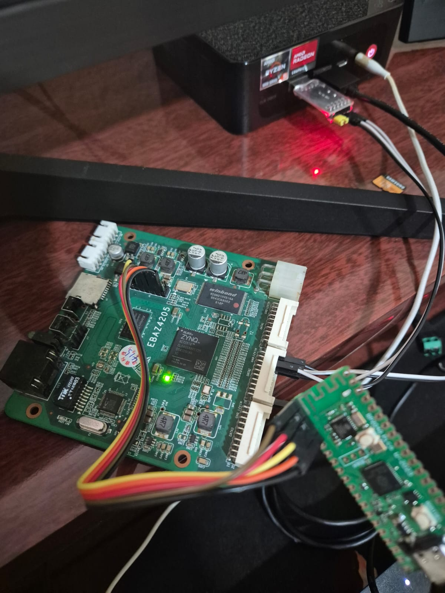

# 🏗️ EBAZ 4205 DuinoCoin FPGA Miner

[](LICENSE)
[](https://en.wikipedia.org/wiki/Verilog)
[](https://www.python.org/)
[](https://github.com)
[](#performance)


### Did you like the project? Leave a star ⭐ or buy me a coffee 💰. 
#### DuinoCoin Wallet: frenow 
#### BTC Wallet: bc1qdf5qhmfymltn8xu52grlnskdelz8unsznljwe5

Um minerador de **DuinoCoin** de alto desempenho implementado em FPGA usando a placa **EBAZ 4205** com Zynq-7010. Implementa **múltiplos cores SHA-1 em paralelo** (`MAX_CORE`, atualmente **18** no fonte) para máxima eficiência criptográfica. **Ativo e minerando** com hashrate real na casa de **milhões de hashes por segundo** (≈ **7,5 MH/s validado com 13 cores**).

> **v2 — otimizações aplicadas:** datapath do nonce reescrito (contador binário+BCD incremental, sem multiplicadores/DSP), `MESSAGE_BLOCK` registrado, `sha1_w_mem` simplificado (always-shift, sem o mux 16:1), somador da rodada em DSP (`use_dsp`), e minerador Python com **validação de hash antes do submit**, conexão serial persistente, estatísticas de sessão e controle de dificuldade compatível com o FPGA. Veja o [Changelog](#-changelog-v2).



---

## 📋 Índice

- [Características](#características)
- [Hardware](#hardware)
- [Arquitetura](#arquitetura)
- [Instalação](#instalação)
- [Configuração](#configuração)
- [Uso](#uso)
- [Estrutura de Arquivos](#estrutura-de-arquivos)
- [Performance](#performance)
- [Troubleshooting](#troubleshooting)
- [Changelog (v2)](#-changelog-v2)
- [Contribuindo](#contribuindo)
- [Licença](#licença)

---

## 🔧 Implementação Dinâmica (Generate Blocks)

A implementação utiliza **Verilog `generate` statements** para criar instâncias parametrizadas sem hardcoding:

### 1. Geração de Nonces (top.v:70-76)

```verilog
generate
    genvar i;
    for (i = 0; i < MAX_CORE; i = i + 1) begin : nonce_gen
        assign nonce[i] = nonce_0 + i;
    end
endgenerate
```

**Resultado com MAX_CORE=18:**
- `nonce[0] = nonce_0 + 0`
- `nonce[1] = nonce_0 + 1`
- ... até `nonce[17] = nonce_0 + 17`

### 2. Nonce em BCD incremental (v2 — sem multiplicadores)

> **Mudança v2:** o antigo módulo `nonce_bcd_simple.v` (conversão binário→decimal com
> multiplicadores/DSP) foi **removido do datapath** (o arquivo continua no projeto,
> porém **órfão/não instanciado**). Aquela conversão combinacional criava um caminho
> crítico de ~77 ns, estourando o clock de 20 ns (50 MHz).

Agora o nonce é mantido **simultaneamente em binário e em BCD** e apenas **incrementado**
`+MAX_CORE` por iteração (soma decimal com ripple simples, barata). Cada core deriva o
seu nonce com um offset pequeno em BCD, sem multiplicadores:

```verilog
// Incremento BCD do nonce base (always @(*), ripple decimal) — top.v
reg [39:0] nonce_bcd_next;   // nonce_bcd_0 + MAX_CORE
// Offset por core dentro do generate: nonce_bcd_0 + z
```

- **Binário** (`nonce_0`, 32 bits): usado para transmitir o resultado e comparar dificuldade.
- **BCD** (`nonce_bcd_0`, 40 bits / 10 dígitos): usado para montar a string ASCII decimal.

### 3. Message Builders REGISTRADOS (v2)

```verilog
generate
    genvar z;
    for (z = 0; z < MAX_CORE; z = z + 1) begin : msg_block_gen
        // ... monta pad (nonce ASCII + 0x80 + zeros + comprimento) ...
        always @(posedge clk) begin
            MESSAGE_BLOCK[z] <= { buffer[0..39], pad };  // 512 bits, REGISTRADO
        end
    end
endgenerate
```

O bloco de 512 bits (padding RFC 3174) agora é **registrado**. A FSM passa por um estado
`STATE_BUILD` para o bloco estabilizar **antes** de disparar o SHA-1, quebrando o caminho
combinacional que estourava o timing.

### 4. SHA-1 Core Instances (v2 — sem porta `next`)

```verilog
generate
    genvar p;
    for (p = 0; p < MAX_CORE; p = p + 1) begin : sha1_loop
        sha1_core sha1_inst (
            .clk(clk),
            .reset_n(rst_n),
            .init(sha1_init[p]),           // caminho multi-bloco (next) removido: 1 bloco só
            .block(MESSAGE_BLOCK[p]),
            .ready(sha1_core_ready[p]),
            .digest(sha1_digest[p]),
            .digest_valid(sha1_digest_valid[p])
        );
    end
endgenerate
```

**Instancia `MAX_CORE` SHA-1 cores** processando em paralelo. Como a mensagem cabe sempre
em **um único bloco** de 512 bits, o caminho multi-bloco (`next`/`first_block`) foi removido.

### Como Escalar para Mais Cores

```verilog
// top.v — parâmetro no topo do módulo
localparam MAX_CORE = 18;  // mude aqui (2, 4, 8, 13, 16, 18, ...)
```

Tudo mais (nonces, BCD, message builders, SHA-1 cores, lógica de match) é gerado
automaticamente via `generate`. **Após alterar, re-sintetize** e verifique LUT/DSP/timing
(o limite prático no Zynq-7010 é definido por LUT e DSP — veja [Performance](#-performance)).

---

### Hardware
- ✅ **FPGA Xilinx Zynq-7010** na placa EBAZ 4205
- ✅ **Múltiplos SHA-1 Cores em Paralelo** (`MAX_CORE`, atualmente 18)
- ✅ **Interface UART** a 115.200 baud
- ✅ **Processamento de Nonces** de 32 bits (até 4.2 bilhões)
- ✅ **Faixa de busca (`DIFFICULTY`)** = 999.999.999 → resolve dificuldade de pool até ~10M
- ✅ **Somador da rodada SHA-1 em DSP** (`use_dsp`) — libera LUTs
- ✅ **Timing fechado em 50 MHz** (após reescrita do datapath do nonce)
- ✅ **Indicadores LED** de status (verde/vermelho)

### Software (minerador Python)
- ✅ **Validação de hash local antes do submit** (não envia resultado incorreto à pool)
- ✅ **Conexão serial persistente** (abre a porta 1x e reutiliza)
- ✅ **Estatísticas de sessão** (aceitas/rejeitadas/inválidas + hashrate médio + uptime)
- ✅ **Filtro de dificuldade** compatível com a faixa do FPGA
- ✅ **Controle do hashrate reportado** (`REPORT_HASHRATE_CAP`) p/ calibrar dificuldade
- ✅ **Reconexão automática** e fechamento seguro do socket
- ✅ **Saída UTF-8 forçada** (não quebra no console do Windows)
- ✅ **Logging detalhado** de shares rejeitadas + cores ANSI

### Protocolo
- ✅ **Compatível com DuinoCoin** (protocolo oficial)
- ✅ **Formato de Job**: `MEDIUM` difficulty
- ✅ **Payload**: 80 bytes (40 bytes mensagem + 40 bytes hash esperado)
- ✅ **Resposta**: 4 bytes nonce (32-bit big-endian)
- ✅ **1 resultado por job** (obrigatório): jobs insolúveis → reconecta (nunca envia submit errado)

---

## 🔧 Hardware

### Especificações da EBAZ 4205

| Componente | Especificação |
|-----------|--------------|
| **FPGA** | Xilinx Zynq-7010 |
| **Lógica** | 28.000 LUTs |
| **Memória BRAM** | 560 KB |
| **Clock** | 50 MHz (Zynq) |
| **Interface** | UART, GPIO |
| **Alimentação** | 12V DC / 2A (via conector) |
| **Dimensões** | ~80x60 mm |

### Pinagem UART

```
UART_RX  → GPIO (entrada serial)
UART_TX  → GPIO (saída serial)
LED_GRN  → GPIO (LED verde - ativo alto)
LED_RED  → GPIO (LED vermelho - ativo alto)
CLK      → FCLK_CLK0 (50 MHz do Zynq)
RST_N    → FCLK_RESET0_N (reset ativo baixo)
```

### Requisitos de Alimentação

```
Tensão:  12V DC
Corrente: 1-2A (pico até 3A durante síntese)
Tipo:    Fonte chaveada (com proteção)
```

---

## 🏛️ Arquitetura

### Diagrama de Blocos

```
┌─────────────────────────────────────────┐
│        Python Controller                │
│  (duino_fpga.py)                        │
│  - Comunica com servidor DuinoCoin      │
│  - Envia jobs via UART                  │
│  - Recebe nonces encontrados            │
└──────────────┬──────────────────────────┘
               │ UART 115200 baud
               │ (80 bytes → 4 bytes)
               ▼
┌─────────────────────────────────────────┐
│     FPGA Top Module (top.v)             │
│  ┌─────────────────────────────────────┐│
│  │  MAX_CORE SHA-1 Cores em Paralelo  ││
│  │  ├─ SHA-1 Core 0 (nonce_0)         ││
│  │  ├─ SHA-1 Core 1 (nonce_0 + 1)     ││
│  │  ├─ SHA-1 Core 2 (nonce_0 + 2)     ││
│  │  ├─ ...                             ││
│  │  └─ SHA-1 Core N-1 (nonce_0 + N-1) ││
│  └─────────────────────────────────────┘│
│  ┌─────────────────────────────────────┐│
│  │  Componentes Suporte                ││
│  │  ├─ UART RX (recebe jobs)           ││
│  │  ├─ UART TX (transmite nonces)      ││
│  │  ├─ Contador nonce binário + BCD    ││
│  │  └─ Message Builder REGISTRADO      ││
│  └─────────────────────────────────────┘│
│                                         │
│  Zynq-7010 Processing System            │
│  └─ Clock: 50 MHz                       │
│  └─ Reset: Ativo baixo                  │
└─────────────────────────────────────────┘
```

### Estratégia MULTI-CORE Dinâmica

A implementação utiliza **módulos gerados dinamicamente** via `generate` blocks do Verilog:

```verilog
// Em top.v (parâmetro no topo do módulo):
localparam MAX_CORE = 18;  // Mude para 2, 4, 8, 13, 16, 18, ...
```

**Processamento em Paralelo (exemplo com MAX_CORE=18):**
```
Lote 0: Processa nonce_0, nonce_0+1, ..., nonce_0+17
Lote 1: Processa nonce_0+18, ..., nonce_0+35
Lote 2: Processa nonce_0+36, ..., nonce_0+53
...

Incremento: nonce_0 += MAX_CORE após cada lote (~86 ciclos por lote)
Ganho: ~MAX_CORE vezes mais rápido (escalabilidade linear até o limite de LUT/DSP)
```

**Arquitetura Dinâmica:**
```
┌─────────────────────────────────────────┐
│ Nonce Generator (Combinacional)         │
│ ├─ nonce[0] = nonce_0 + 0               │
│ ├─ nonce[1] = nonce_0 + 1               │
│ ├─ nonce[2] = nonce_0 + 2               │ (gerado via loop)
│ ├─ nonce[...] = nonce_0 + [...]         │
│ └─ nonce[MAX_CORE-1] = nonce_0 + MAX... │
└─────────────────────────────────────────┘
           ↓ (nonce base em BCD + offset por core)
┌─────────────────────────────────────────┐
│ Nonce BCD (incremental, sem multiplic.) │
│ ├─ nonce_bcd_0  (registrador base)      │
│ ├─ +z por core (ripple decimal simples) │ (ASCII = dígito + 0x30)
│ └─ +MAX_CORE por lote (nonce_bcd_next)  │
└─────────────────────────────────────────┘
           ↓ (nonces em texto ASCII)
┌─────────────────────────────────────────┐
│ Message Builders REGISTRADOS (MAX_CORE) │
│ ├─ MESSAGE_BLOCK[0] <= msg + nonce[0].. │
│ ├─ MESSAGE_BLOCK[1] <= msg + nonce[1].. │ (padding RFC 3174, via STATE_BUILD)
│ └─ MESSAGE_BLOCK[MAX_CORE-1] <= ...     │
└─────────────────────────────────────────┘
           ↓ (512-bit blocks)
┌─────────────────────────────────────────┐
│ SHA-1 Cores (MAX_CORE instâncias)       │
│ ├─ sha1_inst[0] processa nonce[0]       │
│ ├─ sha1_inst[1] processa nonce[1]       │ (SHA-1 em paralelo)
│ └─ sha1_inst[MAX_CORE-1] processa nonce │
└─────────────────────────────────────────┘
```

**Vantagens:**
- ✅ **Escalabilidade via parâmetro**: Mude `MAX_CORE` para 2/4/16/32
- ✅ **Geração automática de código**: Loops `generate` criam instâncias
- ✅ **Paralelismo nativo**: LUT-bound, não memory-bound
- ✅ **Latência reduzida**: MAX_CORE comparações simultâneas
- ✅ **Zero hardcoding**: Toda lógica é parametrizada

---

## 🚀 Instalação

### Pré-requisitos

#### Hardware
- Placa EBAZ 4205
- Fonte de alimentação 12V/2A+
- Conversor USB-UART (FT232RL ou CH340) @ 115200 baud
- Cabo USB-UART ou jumpers de ligação direta

#### Software
- **Python 3.6+**
- **Vivado Design Suite 2020.2+** (para compilar HDL)
- **Xilinx ISE WebPACK** (alternativa)

### Passos de Instalação

#### 1. Clonar Repositório

```bash
git clone https://github.com/seu-usuario/ebaz4205-duino-miner.git
cd ebaz4205-duino-miner
```

#### 2. Instalar Dependências Python

```bash
pip install -r requirements.txt
```

**Conteúdo de `requirements.txt`:**
```
pyserial>=3.5
```

#### 3. Compilar HDL (Vivado)

```bash
cd project_ebaz_miner
vivado -mode batch -source scripts/build.tcl
```

Ou via GUI:
```bash
vivado project_ebaz_miner.xpr &
```

#### 4. Gerar Bitstream

No Vivado:
```
Flow → Run Synthesis
Flow → Run Implementation  
Flow → Generate Bitstream
```

Arquivo gerado: `project_ebaz_miner.runs/impl_1/design_1_wrapper.bit`

#### 5. Programar FPGA

Via Vivado:
```
Program and Debug → Program Device
Selecione: design_1_wrapper.bit
```

Ou via linha de comando:
```bash
vivado -mode batch -source scripts/program.tcl \
  -tclargs design_1_wrapper.bit
```

#### 6. Verificar Conexão Serial

```bash
# Windows (PowerShell)
Get-PnpDevice -Class Ports

# Linux/Mac
ls -la /dev/tty*
```

---

## ⚙️ Configuração

### Arquivo: `duino_fpga.py`

#### Variáveis Principais

```python
# ============ CONFIGURAÇÃO UART ============
COM_PORT = "COM5"         # Porta serial (altere para sua porta)
BAUDRATE = 115200         # Taxa de transmissão
TIMEOUT = 60              # Timeout de recepção (segundos)

# ========== CONFIGURAÇÃO SERVIDOR ==========
NODE_ADDRESS = '92.246.129.145'  # IP do servidor DuinoCoin
NODE_PORT = 5089                 # Porta do servidor

# ===== LIMITES x CAPACIDADE DO FPGA (v2) =====
# Faixa de nonce que o bitstream varre = parâmetro DIFFICULTY no top.v.
#   - Bitstream NOVO (DIFFICULTY=999999999):  FPGA_MAX_NONCE = 999_999_999
#   - Bitstream antigo (teto ~100M):          FPGA_MAX_NONCE = 100_000_000
FPGA_MAX_NONCE = 999_999_999
MAX_DIFFICULTY = FPGA_MAX_NONCE // 100   # dificuldade de pool máx. solucionável

# Hashrate MÁXIMO reportado à pool (ela calibra a dificuldade por este valor).
#   - Bitstream NOVO: use um cap alto (ex.: 20_000_000) p/ reportar o valor REAL.
#   - Bitstream antigo: limite (ex.: 900_000) p/ a dificuldade caber no FPGA.
REPORT_HASHRATE_CAP = 20_000_000

# ========== CREDENCIAIS ==================
username = 'frenow'       # Seu usuário DuinoCoin
mining_key = 'None'       # Mining key (deixar 'None' se não usar)
```

> ⚠️ **Coerência FPGA ↔ script:** `FPGA_MAX_NONCE` deve casar com o `DIFFICULTY`
> gravado no FPGA. Se o script permitir dificuldade maior do que o bitstream
> resolve, o FPGA devolve um nonce inválido — que a **validação de hash** barra
> (sem enviar à pool), forçando reconexão. Veja [Troubleshooting](#-troubleshooting).

#### Como Encontrar Sua Porta Serial

**Windows:**
```powershell
Get-PnpDevice -Class Ports | Select-Object Name,InstanceId
# Procure por "USB" ou "COM"
```

**Linux/Mac:**
```bash
dmesg | tail -20
# ou
ls -la /dev/tty* | grep -i usb
```

#### Configuração da Dificuldade

No servidor DuinoCoin, você pode solicitar dificuldades customizadas modificando:

```python
job_request = f"JOB,{username},MEDIUM,{mining_key}"
# Opções: EASY, MEDIUM, HARD
```

**Como o FPGA e a pool interagem (importante):** a pool escala a dificuldade conforme
o **hashrate reportado**. Com o bitstream novo (`DIFFICULTY=999999999`) o FPGA resolve
até ~10M de dificuldade, então basta reportar o hashrate real (`REPORT_HASHRATE_CAP`
alto). Com o bitstream antigo (teto ~100M / dificuldade ≤ 1M), é preciso **limitar** o
hashrate reportado para a pool não pedir dificuldade acima do que o FPGA alcança — caso
contrário há reconexões constantes.

---

## 💻 Uso

### Execução Básica

```bash
python duino_fpga.py
```

### Output Esperado

```
⛏️  MINERADOR duinoCoin FPGA EBAZ 4205 v1 by @frenow
🔗 [12:34:56] Conectando ao servidor 92.246.129.145:5089...
✓ [12:34:57] Conexão estabelecida com sucesso
✓ [12:34:57] Server Version: 3.0
📦 [JOB #1] Recebido: 8f4e...c0a1,f3d2...a5b2,172800
⚙️  [MINERANDO] Dificuldade: 172800
📤 [ENVIO] 8f4e...c0a1f3d2...a5b2 (80 bytes)
✓ [12:34:58] Share ACEITA | 💰 Nonce: 9123166 | ⚡ Hashrate: 10361 kH/s | 🎯 Dificuldade: 172800
📊 [SESSÃO] ✓ 6 | ✗ 0 | ⚠ inv 0 | Aceitação: 100.0% | ⚡ Média: 10192 kH/s | ⏱ 00:00:04
```

O rodapé **📊 [SESSÃO]** mostra: shares aceitas, rejeitadas pela pool, inválidas barradas
localmente (não enviadas), taxa de aceitação, hashrate médio e tempo de sessão.

### Monitoramento em Tempo Real

```bash
# Em outro terminal, acompanhe logs
tail -f error_logs/rejected_shares_*.txt
```

### Parar Mineração

```
Pressione: Ctrl+C
```

Output:
```
⏹️  [12:35:00] Mineração interrompida pelo usuário
```

---

## 📁 Estrutura de Arquivos

```
ebaz4205-duino-miner/
├── README.md                           # Este arquivo
├── LICENSE                             # MIT License
├── requirements.txt                    # Dependências Python
├── duino_fpga.py                       # Controller principal
├── send.py                             # Utilidade de envio (deprecated)
├── ebaz4205.jpeg                       # Foto da placa
│
├── project_ebaz_miner.xpr              # Projeto Vivado
├── project_ebaz_miner.srcs/
│   ├── sources_1/
│   │   ├── new/
│   │   │   ├── top.v                   # Módulo top (~428 linhas)
│   │   │   │   └── Arquitetura MULTI-CORE parametrizada (MAX_CORE=18)
│   │   │   │   └── Nonce binário + BCD incremental (sem multiplicadores/DSP)
│   │   │   │   └── MESSAGE_BLOCK REGISTRADO + estado STATE_BUILD
│   │   │   │   └── Generate: nonce_gen, msg_block_gen, sha1_loop
│   │   │   │   └── Buffer UART (80 bytes) + padding RFC 3174
│   │   │   │
│   │   │   ├── sha1_core.v             # Core SHA-1 (~403 linhas)
│   │   │   │   └── 80 rodadas; somador da rodada em DSP (use_dsp)
│   │   │   │   └── 160-bit digest output; caminho 'next' removido (1 bloco)
│   │   │   │   └── Ready/digest_valid handshake
│   │   │   │
│   │   │   ├── sha1_w_mem.v            # Memória W scheduler (~67 linhas, v2)
│   │   │   │   └── Expansão do bloco (80 palavras W)
│   │   │   │   └── "always-shift" (sem contador w_ctr / sem mux 16:1)
│   │   │   │
│   │   │   ├── nonce_bcd_simple.v      # (OBSOLETO/órfão — 170 linhas)
│   │   │   │   └── Substituído pelo contador BCD inline no top.v
│   │   │   │   └── Pode ser removido do projeto (Remove File)
│   │   │   │
│   │   │   ├── uart_rx.v               # Receptor UART (145 linhas)
│   │   │   │   └── State machine (IDLE→START→RECV→STOP)
│   │   │   │   └── Detecção de baud rate configurável
│   │   │   │
│   │   │   └── uart_tx.v               # Transmissor UART
│   │   │       └── Envio de dados série
│   │   │
│   │   └── bd/
│   │       └── design_1/               # Block Design Zynq
│   │           ├── design_1.bd
│   │           ├── design_1_wrapper.v
│   │           ├── hdl/
│   │           ├── hw_handoff/
│   │           └── ip/
│   │               ├── design_1_processing_system7_0_0/
│   │               │   └── Zynq PS configuração
│   │               └── design_1_top_0_0/
│   │                   └── Top module compilado
│   │
│   └── constrs_1/
│       └── new/
│           └── constr.xdc              # Constraints Vivado
│               └── Pinagem UART/LED
│               └── Timing constraints
│
├── project_ebaz_miner.runs/
│   ├── impl_1/                         # Implementation output
│   │   └── design_1_wrapper.bit        # Bitstream final
│   └── synth_1/                        # Synthesis output
│
├── error_logs/
│   └── rejected_shares_*.txt           # Logs de erro dinâmicos
│       └── Registra nonce, hashrate, hashes esperados
│
└── scripts/ (futuro)
    ├── build.tcl                       # Script de build Vivado
    ├── program.tcl                     # Script de programação
    └── setup.sh                        # Setup do ambiente
```

### Descrição dos Arquivos Verilog

| Arquivo | Linhas | Propósito |
|---------|--------|----------|
| `top.v` | ~428 | Módulo raiz: MULTI-CORE (MAX_CORE=18), nonce binário+BCD, UART, message builder registrado |
| `sha1_core.v` | ~403 | Core SHA-1 (80 rodadas), somador da rodada em DSP - instanciado MAX_CORE vezes |
| `sha1_w_mem.v` | ~67 | Expansão de palavras W (schedule) — versão "always-shift" (v2) |
| `nonce_bcd_simple.v` | 170 | **OBSOLETO/órfão** — datapath BCD agora é inline no top.v |
| `uart_rx.v` | 145 | Receptor UART com state machine |
| `uart_tx.v` | 135 | Transmissor UART série |

---

## 📊 Performance

### Benchmarks em Produção (v2)

```
┌────────────────────────────────────────────────┐
│  PERFORMANCE REAL - DUINOCOIN NETWORK          │
├────────────────────────────────────────────────┤
│  Hashrate Efetivo:  ~7,5 MH/s (13 cores)      │
│  (medições recentes ~10 MH/s por share)        │
│  Timing 50 MHz:     ✅ FECHADO (WNS > 0)       │
│  Status:            ✅ ATIVO E MINERANDO       │
└────────────────────────────────────────────────┘
```

### Modelo de Throughput

```
Throughput ≈ MAX_CORE / (~86 ciclos por lote) × 50 MHz

  MAX_CORE=13  →  ~7,5 MH/s   (validado)
  MAX_CORE=18  →  ~10,5 MH/s  (alvo — requer validação de síntese)

Cada lote processa MAX_CORE nonces em paralelo; o SHA-1 (80 rodadas,
1 rodada/ciclo) domina os ~86 ciclos. A 50 MHz o hashrate escala com
MAX_CORE até o limite de LUT/DSP do FPGA.
```

### Utilização de Recursos FPGA (build de 13 cores)

| Recurso | Utilização | Disponível | % Utilização |
|---------|-----------|-----------|---------------|
| **LUT** | 16.440 | 17.600 | **93.4%** 🔴 |
| **FF** | 15.003 | 35.200 | **42.6%** 🟢 |
| **DSP** | 80 | 80 | **100%** 🔴 |
| **BRAM** | 0 | 60 | **0%** 🟢 |
| **IO** | 5 | 100 | **5.0%** |

**Análise (limites reais):**
- 🔴 **LUT (93%)** e 🔴 **DSP (100%)** são os recursos que **limitam** o número de cores.
- 🟢 **FF (43%)** e 🟢 **BRAM (0%)** sobram, mas o SHA-1 não mapeia bem neles.
- As otimizações v2 (`sha1_w_mem` always-shift + `use_dsp` só no somador da rodada)
  liberam LUT/DSP para caber **mais cores** — daí o alvo de 16–18.

### Escalabilidade (`MAX_CORE`)

| MAX_CORE | Throughput aprox. | Observação |
|----------|-------------------|------------|
| 8  | ~4,6 MH/s | folgado |
| 13 | ~7,5 MH/s | **validado** (LUT 93% / DSP 100%) |
| 16–18 | ~9–10,5 MH/s | **alvo** após otimizações v2 — validar LUT/DSP/timing |

**Como testar escalabilidade:**
1. Ajuste `localparam MAX_CORE` no `top.v`.
2. Execute síntese + implementação no Vivado.
3. Verifique `*_utilization_placed.rpt` (LUT/DSP < 100%) e o timing (WNS ≥ 0).
4. Se estourar LUT/DSP ou faltar timing, reduza `MAX_CORE`.

---

### Fatores que Afetam Performance

1. **Clock FPGA**: 50 MHz fixo (Zynq)
2. **Latência UART**: 80 bytes × 10 bits / 115200 baud ≈ 7 ms
3. **Overhead de Job**: Reconexão, parsing, reconversão
4. **Dificuldade**: Quanto maior, mais nonces para testar

### Como Medir Real

```python
# No duino_fpga.py (linhas 236-253):
hashingStartTime = time.time()
nonce = send_to_fpga(payload)
hashingStopTime = time.time()
timeDifference = hashingStopTime - hashingStartTime

if nonce > 0:
    hashrate = nonce / timeDifference  # Hashes por segundo
```

---

## 🐛 Troubleshooting

### Problema 1: Porta Serial Não Encontrada

**Erro:**
```
❌ [ERRO FPGA] 'COM5' does not exist or access denied
```

**Solução:**
```python
# Listar portas disponíveis
python -c "import serial.tools.list_ports; print([p.device for p in serial.tools.list_ports.comports()])"

# Atualizar duino_fpga.py com a porta correta
COM_PORT = "COM3"  # ou /dev/ttyUSB0 no Linux
```

### Problema 2: Timeout na FPGA

**Erro:**
```
✗ [12:35:00] Timeout na FPGA, solicitando novo job
```

**Causas & Soluções:**
```
a) FPGA não programada:
   → Reprograme o bitstream via Vivado
   
b) Conexão UART ruim:
   → Verifique cabos/conectores
   → Tente taxa menor (57600 baud)
   
c) Fonte de alimentação fraca:
   → Use fonte 12V/2A+ com proteção
   → Mina dados de queda de tensão
   
d) Clock não estável:
   → Verifique LED de power da placa
   → Teste com osciloscópio (50 MHz)
```

### Problema 3: Shares Rejeitadas Frequentemente

**Erro:**
```
⚠️  [12:35:00] BAD: BAD_HASH
```

**Nota v2:** o minerador agora **valida o hash localmente antes de enviar**
(`is_valid_share`), então resultados incorretos **não chegam mais à pool** — em vez
de `BAD`, você verá `⚠ INVÁLIDO — NÃO enviado à pool, reconectando`.

**Causas & Soluções:**
```
a) Dificuldade acima da capacidade do FPGA (causa mais comum):
   → nonce excede FPGA_MAX_NONCE → hash não confere → reconecta
   → Ajuste FPGA_MAX_NONCE/REPORT_HASHRATE_CAP (ver Problema 6) ou regrave o FPGA

b) Padding de mensagem incorreto:
   → Valide o padding RFC 3174 no top.v (bloco msg_block_gen)

c) Endianness / buffer:
   → SHA-1 usa big-endian; valide os 80 bytes recebidos via UART
```

### Problema 4: Conexão Recusada ao Servidor

**Erro:**
```
✗ [12:35:00] Falha na conexão: [Errno 111] Connection refused
```

**Soluções:**
```bash
# Verificar conectividade
ping 92.246.129.145

# Testar porta
nc -zv 92.246.129.145 5089

# Possível servidor offline:
# Tente outro servidor DuinoCoin:
NODE_ADDRESS = '145.239.86.42'  # Alternativo
NODE_PORT = 5089
```

### Problema 5: Python ImportError

**Erro:**
```
ModuleNotFoundError: No module named 'serial'
```

**Solução:**
```bash
pip install pyserial
# ou
pip install -r requirements.txt
```

### Problema 6: Mineração Reinicia/Reconecta Constantemente

**Sintoma:**
```
⚠️  Dificuldade alta demais p/ o FPGA: 1982120 (máx: 1000000) - reconectando
... (reconecta, começa do zero, repete) ...
```

**Causa:** a pool **escala a dificuldade conforme o hashrate reportado**. Se o valor
reportado for alto demais para o que o bitstream resolve, a pool pede uma dificuldade
cujo nonce excede a faixa do FPGA → o job é insolúvel → reconexão a cada ciclo.

**Soluções:**
```
a) Regravar o FPGA com DIFFICULTY=999999999 (recomendado):
   → FPGA_MAX_NONCE   = 999_999_999
   → REPORT_HASHRATE_CAP = 20_000_000   # reporta o hashrate REAL
   → A pool passa a atribuir dificuldade solucionável; estabiliza sem reconectar

b) Sem regravar (bitstream antigo, teto ~100M):
   → FPGA_MAX_NONCE   = 100_000_000
   → REPORT_HASHRATE_CAP = 900_000      # limita o hashrate reportado
   → A pool mantém a dificuldade dentro da faixa do FPGA (estável),
     porém com subnotificação de hashrate (menor recompensa por share)
```

> A opção (a) é a única que reporta o hashrate verdadeiro **e** mantém a mineração estável.

---

## 🔬 Desenvolvimento & Testing

### Testar Escalabilidade com Diferentes MAX_CORE

**Passo 1: Alterar parametrização**

```verilog
// Editar project_ebaz_miner.srcs/sources_1/new/top.v

// Parâmetro no topo do módulo:
localparam MAX_CORE = 13;  // ajuste e re-sintetize (8, 13, 16, 18, ...)

// Verificar LUT/DSP/timing após cada síntese
```

**Passo 2: Compilar e verificar**

```bash
vivado -mode batch -source scripts/build.tcl

# Utilização (LUT/DSP) e timing
grep -E "Slice LUTs|DSPs" project_ebaz_miner.runs/impl_1/*utilization_placed.rpt
grep -E "All user|violated|WNS"  project_ebaz_miner.runs/impl_1/*timing_summary_routed.rpt
```

**Passo 3: Escalabilidade real (v2, após otimizações)**

| MAX_CORE | LUT% | DSP% | Timing 50 MHz | Viável? |
|----------|------|------|---------------|---------|
| 8  | ~60% | ~65% | ✅ | ✅ |
| 13 | 93%  | 100% | ✅ (WNS>0) | ✅ **validado** |
| 16–18 | a validar | a validar | a validar | 🎯 alvo |

**Conclusão:** os limites reais no Zynq-7010 são **LUT e DSP** (não FF/BRAM). Com as
otimizações v2, 13 cores fecham em 50 MHz; 16–18 é o alvo a validar por síntese.

### Testar Módulo SHA-1 Isolado

```verilog
// test_sha1_core.v
module test_sha1;
  // ...
  // Teste com vetor conhecido
  // Entrada: "abc" (0x61626380...)
  // Saída SHA-1: a9993e364706816aba3e25717850c26c9cd0d89d
endmodule
```

### Testar UART Loopback

```bash
# Conectar TX → RX (loop)
python -c "
import serial
ser = serial.Serial('COM5', 115200)
ser.write(b'TEST' * 20)  # 80 bytes
response = ser.read(4)
print(f'Response: {response.hex()}')
"
```

### Simular Job Offline

```python
# Criar job conhecido
message_hash = "8f4e" + "0" * 36  # 40 chars
expected_hash = "f3d2" + "0" * 36  # 40 chars
payload = (message_hash + expected_hash).encode('ascii')
assert len(payload) == 80
print(f"Payload válido: {len(payload)} bytes")
```

---

## 📝 Changelog (v2)

### Hardware (Verilog)
- ✅ **Datapath do nonce reescrito:** contador **binário + BCD incremental** (`+MAX_CORE`
  por lote, ripple decimal). Removeu os multiplicadores/DSP e o caminho crítico de ~77 ns
  que **estourava o timing** de 50 MHz. `nonce_bcd_simple.v` ficou obsoleto.
- ✅ **`MESSAGE_BLOCK` registrado** + estado **`STATE_BUILD`** (bloco estável antes do `init`).
- ✅ **`sha1_w_mem` "always-shift":** removidos o contador `w_ctr` e o **mux 16:1** (que
  estava no caminho crítico e gastava ~2000 LUTs). Módulo caiu de ~260 → ~67 linhas.
- ✅ **`use_dsp` no somador da rodada** (`a_reg`) — libera LUTs; somadores do digest em LUT.
- ✅ **Limpeza:** caminho multi-bloco (`next`/`first_block`) removido; funções `bcd_add`/
  `bcd_len` inlinadas; `sha1_digest_valid_reg[]` removido.
- ✅ **`DIFFICULTY` = 999.999.999** (faixa de nonce ~1G → resolve dificuldade de pool até ~10M).
- ✅ **Timing 50 MHz fechado** (WNS > 0) e **`MAX_CORE` elevado** (13 validado; 16–18 alvo).

### Software (duino_fpga.py)
- ✅ **Validação de hash local antes do submit** (`is_valid_share`) — nunca envia resultado incorreto.
- ✅ **Conexão serial persistente** (sem abrir/fechar por job) + `reset_input_buffer()`.
- ✅ **Estatísticas de sessão** (aceitas/rejeitadas/inválidas, taxa, hashrate médio, uptime).
- ✅ **Filtro de dificuldade** (`MAX_DIFFICULTY`) e **cap de hashrate** (`REPORT_HASHRATE_CAP`).
- ✅ **Reconexão limpa** (1 resultado por job; job insolúvel → reconecta) + `finally` fecha socket.
- ✅ **Saída UTF-8 forçada** (corrige crash de emoji no console do Windows).

---

## 🚀 Próximas Melhorias

### Core Architecture
- [ ] **Validar e fixar `MAX_CORE`** máximo (16–18) com síntese/timing no hardware
- [ ] **Pipeline SHA-1** (limitado pelos FF do 7z010 — ver análise) 
- [ ] **Suporte a SHA-256** (novo algoritmo, parametrizável)

### Software & Connectivity
- [ ] **Suporte a múltiplos servidores** com failover automático
- [ ] **Pool mining direto** (Stratum protocol)
- [ ] **Dashboard Web** em tempo real
- [ ] **Log persistente** em cartão SD

### Hardware Features
- [ ] **Monitoramento de temperatura** (sensor DS18B20)
- [ ] **OTA (Over-The-Air) updates** via Zynq
- [ ] **Controle de clock dinâmico** (DVFS - Dynamic Voltage and Frequency Scaling)

### Experimental
- [ ] **Suporte a outras criptos** (Scrypt, Ethash, etc.)
- [ ] **Machine Learning inference** em cores ociosos

---

## 📖 Guia de Código-Fonte

### top.v - Módulo Principal (~428 linhas, v2)

**Estrutura (por blocos, não por linha fixa):**

```
Cabeçalho/params:   CLK_FRE, UART_FRE, DIFFICULTY=999999999, MAX_CORE=18
Nonce:              nonce_0 (binário) + nonce_bcd_0 (BCD) + nonce_bcd_next (incremento)
Decode hash:        buffer[40..79] → SHA1_EXPECTED (160 bits)
Message builder:    generate msg_block_gen → MESSAGE_BLOCK[z] REGISTRADO (padding RFC 3174)
SHA-1 cores:        generate sha1_loop → MAX_CORE instâncias
Combinacional:      all_digest_ready, all_cores_ready, match_found, match_index
FSM SHA-1:          RESET → IDLE → BUILD → INIT_SHA1 → RUNNING → DONE_WAIT → RESULT
FSM UART:           IDLE → BUFFER_FULL → TRANSMIT_NONCE → TX_DONE
```

**Seções Dinâmicas (Generate Loops):**

| Genvar | Loop | Instâncias | Propósito |
|--------|------|-----------|----------|
| i | nonce_gen | MAX_CORE | Nonce binário derivado (`nonce_0 + i`) |
| x | hex_decode | 20 | Decodifica hash esperado (ASCII hex → binário) |
| z | msg_block_gen | MAX_CORE | Nonce BCD (+z), ASCII e MESSAGE_BLOCK registrado |
| p | sha1_loop | MAX_CORE | SHA-1 cores |
| v | status_check | MAX_CORE | Flags ready/digest_valid/match |

**Arrays Dinâmicos (dimensão [0:MAX_CORE-1]):**

```verilog
wire [31:0]  nonce [0:MAX_CORE-1]         // Nonces binários derivados
reg  [511:0] MESSAGE_BLOCK [0:MAX_CORE-1] // Blocos SHA-1 (REGISTRADOS)
wire [159:0] sha1_digest [0:MAX_CORE-1]   // Resumos SHA-1
wire         sha1_digest_valid [0:MAX_CORE-1]
reg  [159:0] sha1_digest_reg [0:MAX_CORE-1]
```
> Removidos na v2: `digit9..digit1[]`, `nonce_ascii[]`, `nonce_ascii_len[]`,
> `sha1_next[]`, `sha1_digest_valid_reg[]` (não mais necessários).

**State Machines:**
1. **SHA-1:** RESET → IDLE → **BUILD** → INIT_SHA1 → RUNNING → DONE_WAIT → RESULT
   (`BUILD` registra o MESSAGE_BLOCK do nonce atual; `RUNNING` dá 1 ciclo para o
   `init` limpar o `digest_valid` do lote anterior)
2. **UART:** IDLE → BUFFER_FULL → TRANSMIT_NONCE → TX_DONE

### Outros Módulos

- **sha1_core.v** (~403 linhas): Core SHA-1 (80 rodadas); somador da rodada em DSP (`use_dsp`); caminho multi-bloco removido
- **sha1_w_mem.v** (~67 linhas): expansão W "always-shift" (sem contador/mux 16:1)
- **nonce_bcd_simple.v** (170 linhas): **obsoleto/órfão** (substituído pelo BCD inline)
- **uart_rx.v** (145 linhas): Receptor UART com state machine
- **uart_tx.v** (135 linhas): Transmissor UART série

---

## 📚 Referências

- [DuinoCoin Official](https://github.com/revoxAE/duino-coin)
- [Xilinx Zynq-7010 Datasheet](https://www.xilinx.com/support/)
- [SHA-1 RFC 3174](https://tools.ietf.org/html/rfc3174)
- [Verilog 2001 Standard](https://en.wikipedia.org/wiki/Verilog)
- [EBAZ 4205 Resources](https://www.ebazresources.com/)

---

## 🤝 Contribuindo

Contribuições são bem-vindas! Por favor:

1. **Fork** o projeto
2. **Crie uma branch** (`git checkout -b feature/AmazingFeature`)
3. **Commit** suas mudanças (`git commit -m 'Add AmazingFeature'`)
4. **Push** para a branch (`git push origin feature/AmazingFeature`)
5. **Abra um Pull Request**

### Linhas Diretrizes

- Mantenha compatibilidade com Python 3.6+
- Documente mudanças em Verilog com comentários
- Teste em hardware real antes de PR
- Siga padrão de naming: `snake_case` (Python), `lower_case` (Verilog)

---

## 📝 Licença

Este projeto está licenciado sob a **MIT License** - veja arquivo [LICENSE](LICENSE) para detalhes.

**Resumo:**
- ✅ Uso comercial
- ✅ Modificação
- ✅ Distribuição
- ❌ Responsabilidade limitada
- ❌ Sem garantia

---

## 📧 Contato & Suporte

- **Autor**: @frenow
- **Issues**: [GitHub Issues](https://github.com/seu-usuario/ebaz4205-duino-miner/issues)
- **Discussions**: [GitHub Discussions](https://github.com/seu-usuario/ebaz4205-duino-miner/discussions)
- **Email**: seu.email@exemplo.com

---

## 🙏 Agradecimentos

- **Xilinx** por Vivado e Zynq
- **Secworks Sweden AB** por sha1_core.v open-source
- **DuinoCoin Community** pelo protocolo e suporte
- **EBAZ Community** pelos recursos e documentação

---

## ⚡ Quick Start (TL;DR)

```bash
# 1. Clonar
git clone https://github.com/seu-usuario/ebaz4205-duino-miner.git && cd ebaz4205-duino-miner

# 2. Instalar
pip install -r requirements.txt

# 3. Configurar porta serial
nano duino_fpga.py  # Altere COM_PORT para sua porta

# 4. Programar FPGA
vivado -mode batch -source scripts/build.tcl

# 5. Minerar!
python duino_fpga.py
```

---

**Feliz mineração! ⛏️💰**

*Última atualização: 02 Julho 2026*
*Versão: 2.0 (datapath do nonce reescrito, w_mem always-shift, use_dsp, validação de hash + estatísticas no minerador)*

